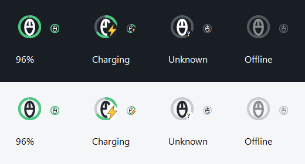

# MCHOSE A7 Pro Battery

在 Windows 工作列右下角查看 **MCHOSE A7 Pro 滑鼠電量**。
一個滑鼠圖示，搭配電量環與放大的充電閃電，無需一直開著原廠設定介面。

**[下載最新版（Windows x64）](https://github.com/xian1022/MCHOSE-A7pro-Battery/releases/latest)** · [回報問題](https://github.com/xian1022/MCHOSE-A7pro-Battery/issues)

這是社群製作的非官方工具，與 MCHOSE 無隸屬關係。目前只針對 A7 Pro 的指定 USB 接收器與有線介面驗證，不保證其他型號或韌體相容。



上圖為程式實際繪圖器產生的狀態示意，含 40px 與 16px 圖示；數值為示例。

## 下載與使用

1. 到 [Releases](https://github.com/xian1022/MCHOSE-A7pro-Battery/releases/latest) 下載 `MCHOSE-A7pro-Battery-win-x64.zip`，不是 GitHub 自動產生的 Source code 壓縮檔。
2. 將壓縮檔**完整解壓縮**到固定資料夾，執行其中的 `MchoseBattery.exe`。請保留同資料夾內的 DLL 等檔案。
3. 開啟滑鼠並插入 2.4G 接收器，圖示會出現在右下角系統匣。若藏在 `^` 裡，將滑鼠圖示拖到時鐘旁。
4. 移上圖示查看電量與充電狀態；左鍵查看詳細狀態，右鍵開啟選單。

發佈包內含 .NET 執行環境，不需另外安裝 .NET，也不需要系統管理員權限。已在 **Windows 11 x64** 實測。程式未做數位簽章；下載來源與 SHA-256 校驗檔均可在 Release 頁核對，無需關閉 Windows 安全防護。

## 功能

- **一個滑鼠圖示**：百分比電量環，高電量綠色、21–50% 黃色、20% 以下紅色。
- **充電閃電**：只有裝置明確回報充電時顯示，不以 USB 接收器通電推測充電。
- **每 30 秒更新**，也能右鍵「立即重新整理」。
- 支援接收器插拔通知與電腦睡眠恢復後重新讀取。
- 「電量未知」與灰色「未連線」分開顯示；成功讀值超過 90 秒不再當成即時電量。
- 可切換「登入時自動啟動」，**首次執行預設開啟**；只允許一個程式實例。
- 無帳號、雲端、遙測上傳或背景更新檢查；狀態與診斷只存在本機。

開啟後沒有主視窗，會持續常駐系統匣。自 v1.0.1 起，首次正常執行會登記登入自動啟動，請先完整解壓至固定資料夾再執行；下載或解壓本身不會啟用設定。既有使用者若曾取消自動啟動，更新後仍保留關閉選擇，可在右鍵選單重新勾選。已啟用時，從新資料夾執行會更新啟動路徑。診斷與預覽模式不修改自動啟動設定。

可用右鍵「結束」完全關閉程式。登入自動啟動不等於當機自動重啟；正常從檔案總管或 Windows 登入啟動即可獨立常駐，不需開著 Codex 或終端機。

## 相容性與已知限制

| 連線／功能 | 驗證結果 |
| --- | --- |
| A7 Pro 2.4G 接收器 `5253:1021` | 實機可讀百分比；測得 96% |
| A7 Pro USB 資料／充電線 `5253:0010` | 實機可讀百分比與充電旗標 |
| 插線開始充電 | 已實測，顯示閃電 |
| 拔線回到無線 | 重新取得有效無線回報後，確認未充電、閃電消失 |
| 接收器讀取逾時後重插 | 已觀察到恢復；仍有偶發逾時問題 |
| 充滿狀態、長時間遊戲、電腦實際睡眠恢復 | 尚未完成完整人工驗證 |
| 與原廠工具同時比對百分比 | 尚未完成；數值來自裝置實際回報 |
| 藍牙、其他滑鼠型號、其他接收器／韌體 | 未驗證 |

曾遇到接收器 USB 控制查詢逾時（Windows 錯誤 121），此時顯示「電量未知」。將接收器拔下再插回、移動滑鼠，再按「立即重新整理」可嘗試恢復。尚未確定是否與原廠工具並行存取有關，不應把關閉原廠工具視為保證修復。

每次讀取都在獨立背景程序執行，最多等待 5 秒，逾時會終止該次讀取。程式不會自動重設 USB、不修改 DPI／按鍵／韌體，也不攔截滑鼠輸入。若同時使用其他電量工具，建議先停用重複輪詢以便排查問題。

## 設定、診斷與移除

本機資料位於 `%LOCALAPPDATA%\MchoseBattery`：

- `status.json`：最近一次狀態與最後成功更新時間。
- `settings.json`：首次啟動及操作自動啟動切換後儲存的設定。
- `battery.log`、`battery.log.1`：輪替診斷紀錄，每份約 1 MB。

右鍵「開啟診斷資料夾」即可查看。回報問題時請附 Windows 版本、連線方式、接收器 VID/PID、問題發生步驟及相關紀錄；分享前請自行檢查紀錄中的本機路徑。

若需手動產生一次診斷，在**解壓後資料夾**開啟 PowerShell：

```powershell
Start-Process -FilePath '.\MchoseBattery.exe' -ArgumentList '--diagnose', 'status.json' -WindowStyle Hidden -Wait
Get-Content .\status.json
```

移除方式：取消「登入時自動啟動」→ 選擇「結束」→ 刪除解壓縮資料夾。若不保留紀錄，也可刪除 `%LOCALAPPDATA%\MchoseBattery`。自動啟動使用目前使用者 `HKCU\Software\Microsoft\Windows\CurrentVersion\Run` 下的 `MchoseBattery` 項目，不會建立服務或排程工作。

## 從原始碼建置

需求：Windows、**.NET 8 SDK**、PowerShell，以及首次還原套件的網路連線。

```powershell
git clone https://github.com/xian1022/MCHOSE-A7pro-Battery.git
cd MCHOSE-A7pro-Battery
.\build.ps1
```

若 SDK 不在 PATH，可使用 `./build.ps1 -DotnetPath 'C:\path\to\dotnet.exe'`。

腳本會執行測試、建立含執行環境的 x64 版本，並輸出：

- `dist/MchoseBattery/`：可執行程式與相依檔案。
- `artifacts/MCHOSE-A7pro-Battery-win-x64.zip`：分享用壓縮包。
- 同名 `.zip.sha256`：SHA-256 校驗檔。

只執行測試：

```powershell
dotnet run --project tests/MchoseBattery.Tests -c Release
```

`src/MchoseBattery.Core` 包含回報解析、過期資料處理及程序管理；`src/MchoseBattery` 包含原生 Windows HID 存取與 WinForms 系統匣介面。HID 使用指定 vendor collection `FF01`，21-byte feature report `11`，查詢內容為唯讀資訊命令 `06` 的 XOR 編碼。測試涵蓋實機封包、異常資料、充電判定、資料過期、讀取逾時、結束程序與睡眠恢復世代防護。

## 授權與致謝

本專案採 [MIT License](LICENSE)。通訊格式參考 [alexfrih/mchose-linux](https://github.com/alexfrih/mchose-linux)（MIT），並以 A7 Pro 實機回報驗證。裝置變動通知使用 [HidSharp](https://github.com/IntergatedCircuits/HidSharp)（Apache-2.0）。完整第三方聲明見 [THIRD-PARTY-NOTICES.txt](THIRD-PARTY-NOTICES.txt)。

作者：`xian.1022`
